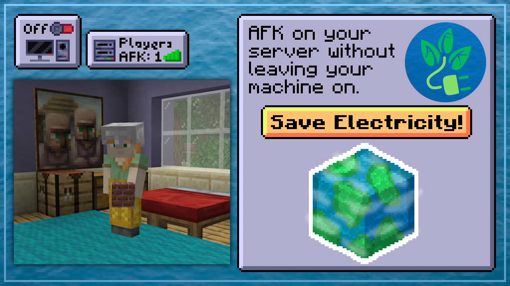

# SaveAFK

**SaveAFK** lets a player disconnect and leave a stand-in bot behind. Your farms keep ticking, your PC does not. Type `/safk`, shut the machine off, and pick up where you left off when you reconnect.

## Prerequisites & Installation
* **Mod Loader:** Fabric
* **Minecraft Version:** 1.19.2 up to 26.2

## Features
* **Go Green:** Turn off your PC while your player-bot continues to AFK for you.
* **Customizable Timeouts:** Set how long a bot stays up. The default is 129600 minutes (90 days).
* **Admin Control:** Server administrators have full command control to spawn, kick, or manage AFK bots.
* **Safety Options:** Reset health on death, disable damage for AFK bots, or hide them from other players and operators.
* **Server Restart:** Bots respawn after a server restart, with a short delay.

## Commands

### Player Commands
* **`/safk [<minutes>] [<reason>]`**: Disconnects you and leaves a bot standing in your place.
  * *Note: the single-player server owner cannot use this*.
* **`/afk [<minutes>] [<reason>]`**: Same thing under the name most players already know. Off by default, and it stays off if another AFK mod has claimed `/afk`.

### Admin Commands
Requires permission level 4 by default.
* **`/safk-admin`**: Displays information about the mod.
* **`/safk-admin save`**: Saves the current configuration.
* **`/safk-admin reload`**: Reloads the configuration, discarding unsaved changes.
* **`/safk-admin purge`**: Resyncs the tracked player/bot maps against the live server. It does not prune stored records — use `forget` for that.
* **`/safk-admin forget <player>`**: Drops a stored player record. Refused while that player is connected or AFK.
* **`/safk-admin spawn <player> [<minutes>] [<reason>]`**: Manually spawns an AFK bot for a player.
* **`/safk-admin kick <player>`**: Removes an active AFK bot.
* **`/safk-admin info [<player>]`**: Detailed debug information for a player. (`advancedAdminOptions` unlocks the full player info)
* **`/safk-admin list [players|bots|all]`**: Lists tracked players or active bots. (`advancedAdminOptions` unlocks the sub commands)
* **`/safk-admin set <setting> <value>`**: Sets a config value. (`advancedAdminOptions` unlocks this sub command, except for `advancedAdminOptions` itself, so you can always switch it back on)

`advancedAdminOptions` takes effect immediately — no restart needed.

## Configuration

Settings live in `config/safk.json`.

| Category     | Option                        | Description                                                                                               | Default  |
|:-------------|:------------------------------|:----------------------------------------------------------------------------------------------------------|:---------|
| **Main**     | `safkEnabled`                 | Toggles the entire AFK feature.                                                                           | `true`   |
| **Main**     | `debugMode`                   | Enables debugging output.                                                                                 | `false`  |
| **Main**     | `reducedListDebugInfo`        | Reduced output for the information commands.                                                              | `true`   |
| **Main**     | `advancedAdminOptions`        | Enables advanced admin options, such as `set`.                                                            | `false`  |
| **Safk**     | `defaultSafkTimeout`          | Default timeout in minutes. Ships at 90 days.                                                             | `129600` |
| **Safk**     | `maxSafkTimeout`              | Longest timeout a player may request, in minutes. `-1` removes the limit.                                 | `129600` |
| **Safk**     | `maxConcurrentBots`           | How many AFK bots may exist at once, server-wide. `-1` removes the limit.                                 | `-1`     |
| **Safk**     | `resetHealthUponDeath`        | Resets the bot's health when it is killed.                                                                | `false`  |
| **Safk**     | `safkDisableDamage`           | Prevents the bot from taking damage.                                                                      | `false`  |
| **Safk**     | `safkHidePlayer`              | Makes the bot invisible to others.                                                                        | `false`  |
| **Safk**     | `safkHideFromOps`             | Hides the bot from operators as well.                                                                     | `false`  |
| **Command**  | `safkCommandPermissions`      | Permission level required for `/safk`.                                                                    | `0`      |
| **Command**  | `safkAdminCommandPermissions` | Permission level for `/safk-admin`.                                                                       | `4`      |
| **Command**  | `afkCommandPermissions`       | Permission level required for `/afk`.                                                                     | `0`      |
| **Command**  | `enableSafkCommand`           | Enables the `/safk` command.                                                                              | `true`   |
| **Command**  | `enableAfkCommand`            | Enables the `/afk` command. (works the same as `/safk`)                                                   | `false`  |
| **Messages** | `broadcastMessages`           | Broadcasts AFK status messages.                                                                           | `false`  |
| **Messages** | `hideSafkJoin`                | Suppresses the default `player has joined` messages while bots are spawned, where possible.               | `false`  |
| **Messages** | `displayDuration`             | Shows the duration in AFK status messages.                                                                | `false`  |
| **Messages** | `displayReturnFeedback`       | Shows why an AFK session ended.                                                                           | `false`  |

### Limits

Two options bound what players can ask for. Set either to `-1` to remove that limit entirely.

`maxSafkTimeout` ships equal to `defaultSafkTimeout`, so out of the box it caps nothing — lower it to tighten. A player who names a longer time gets refused and told the maximum. When the *default* runs past the cap, SaveAFK trims the session instead of refusing, so a misconfigured default can never leave a bare `/safk` broken.

`maxConcurrentBots` ships off, because the right number depends on your slot count. Set it to a positive number and `/safk` is refused once that many bots are up.

Neither limit applies to `/safk-admin spawn` — operators can always place a bot.

**Messages & Formatting:**
Every broadcast message is configurable. The kick message a player sees on a successful `/safk` defaults to `"§6Your player will be AFK§r"`.
`duration` and `timeDate` are CoreLib time formatting options, used by the broadcast messages when `displayDuration` is on.

### Example Config
[CONFIG.md](CONFIG.md)

## Credits

SaveAFK is a fork of [Unplugged-AFK](https://github.com/sakura-ryoko/unplugged-afk) by Sakura-Ryoko, and stays under the same LGPL-3.0 license. It also depends on Sakura-Ryoko's [CoreLib](https://github.com/sakura-ryoko/corelib).
